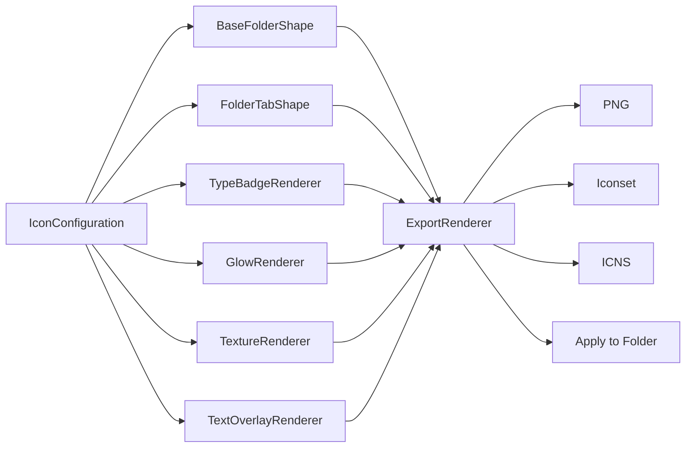

# PokeFolders

<p align="center">
  
</p>

Design beautiful elemental folder icons for macOS, then export them or apply them directly to real Finder folders.


PokeFolders is a real native macOS utility for making original creature-collection-inspired folder icons. It uses SwiftUI for the desktop interface, AppKit for macOS panels and folder icon application, and CoreGraphics/CoreText for crisp high-resolution icon rendering.

This project does not include official character artwork, logos, trademarks, or branded assets. Every bundled theme is an original elemental design inspired by the broader language of collectible creature games.

## What It Makes

```text
Classic folder silhouette
        +
Elemental color system
        +
Custom badge, glow, shadow, texture, and text
        =
Finder-ready macOS folder icon
```

## Highlights

| Area | What PokeFolders does |
| --- | --- |
| Native app | SwiftUI sidebar, live preview, inspector, toolbar, onboarding, light and dark mode |
| Pack browser | Eight production icon packs with 40 predesigned folder icons |
| Customization | Base color, tab color, accent, badge type, glow, shadow, gradient, texture, text, badge position, radius, icon size, transparency |
| Live preview | 512x512 canvas, Finder-size thumbnails, and light/dark desktop checks |
| Export | PNG 128/256/512/1024 assets, `.iconset`, full `.icns`, full pack folder, and ZIP generation |
| Apply | Select a real folder and set its Finder icon using `NSWorkspace` |
| Presets | Save, load, rename, and delete local JSON presets |
| Drag and drop | Drop an image into the preview to use it as a custom badge or watermark |

## Built-In Production Packs

- Starter Pack
- Legendary Pack
- Electric Pack
- Fire Pack
- Water Pack
- Grass Pack
- Dark Pack
- Pixel Retro Pack

Each pack includes five unique designs. The committed asset tree contains 160 generated PNG files: 40 icons across 1024, 512, 256, and 128 sizes.

## App Structure

```text
PokeFolders/
  Package.swift
  Sources/
    PokeFolders/                 Native SwiftUI macOS app
      App/
      Views/
      Support/
    PokeFoldersCore/             Models, rendering, export, folder apply, presets
      Models/
      Rendering/
      Services/
      Stores/
    PokeFoldersCoreChecks/       Framework-free verification executable
    PokeFoldersAssetGenerator/   PNG and Image 2.0 prompt generation
  Assets/
    IconPacks/                   Generated PNG assets
    GenerationPrompts/           Image 2.0 prompt markdown
  Docs/
    IconDesignSystem.md          Design rules and copyright safety
  script/
    check.sh
    build_and_run.sh
    generate_icon_assets.sh
```

## Rendering Pipeline



## Requirements

- macOS 13 or newer
- Xcode Command Line Tools
- Swift 5.9 compatible package tooling
- `iconutil` for `.icns` export, included with macOS

## Run Locally

```bash
git clone https://github.com/ayushap18/pokefolders.git
cd pokefolders
./script/check.sh
./script/build_and_run.sh
```

The run script builds the SwiftPM product, stages a real app bundle at `dist/PokeFolders.app`, and launches it as a foreground macOS app.

## Verification

PokeFolders includes a small executable check target instead of relying on a specific test framework being available in every Command Line Tools install.

```bash
./script/check.sh
```

The checks cover:

- Required bundled themes and preset packs
- Random configuration bounds
- CoreGraphics rendering at 512x512
- PNG export
- `.iconset` export
- `.icns` export through `iconutil`
- Full pack export with PNG folders, iconsets, README, and ZIP
- Preset save, rename, reload, and delete behavior

## Generate or Replace PNG Assets

The repository includes CoreGraphics-rendered placeholder production assets. Regenerate them with:

```bash
./script/generate_icon_assets.sh
```

To replace them with Image 2.0 output:

1. Open the prompt file for a pack in `Assets/GenerationPrompts`.
2. Generate a single 1024x1024 transparent PNG per icon.
3. Replace the matching `*_1024.png` in `Assets/IconPacks/<PackName>`.
4. Downscale to 512, 256, and 128 using a high-quality image pipeline.
5. Keep file names unchanged.

## Export Formats

PokeFolders can generate the standard macOS icon sizes:

```text
16x16
32x32
64x64
128x128
256x256
512x512
1024x1024
```

For `.iconset`, it writes Finder-compatible filenames such as `icon_16x16.png`, `icon_16x16@2x.png`, and `icon_512x512@2x.png`.

Full pack export creates:

```text
PokeFolders-<Pack-Name>/
  PNG/
    1024/
    512/
    256/
    128/
  ICNS-Ready/
  README.txt
PokeFolders-<Pack-Name>.zip
```

## Design Notes

PokeFolders is intentionally not a web app. The app uses:

- `SwiftUI` for the main macOS interface
- `AppKit` for `NSOpenPanel`, `NSSavePanel`, app activation, and folder icon application
- `CoreGraphics` and `CoreText` for deterministic icon rendering
- `ImageIO` for PNG encoding and dropped custom badge images
- `UserDefaults`-free local JSON storage for portable presets

## Trademark Note

PokeFolders is an independent creative utility. It is not affiliated with, endorsed by, or sponsored by Nintendo, Game Freak, Creatures Inc., or The Pokemon Company. The app avoids official logos, character artwork, and copyrighted assets.

## License

No license has been selected yet. Add one before accepting external contributions.
